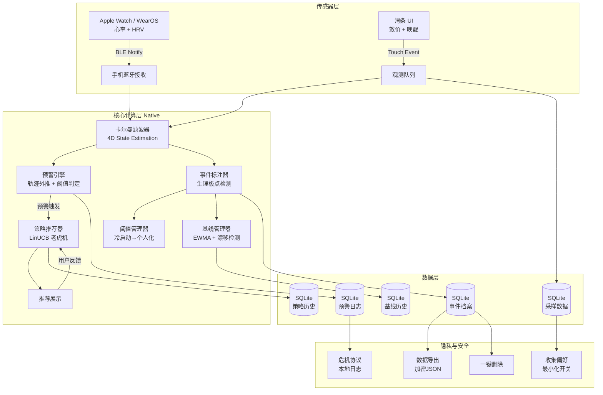

# EmoWave 移动端部署架构预研文档

> **项目背景**: EmoWave 情绪追踪引擎当前全部代码基于 Python 实现。本文档旨在设计一套跨平台部署策略，覆盖 iOS 与 Android 两端，为从 Python 原型到生产级移动应用的迁移提供技术路线参考。

---

## 目录

1. [核心算法迁移方案对比](#1-核心算法迁移方案对比)
2. [数据层设计](#2-数据层设计)
3. [后台任务与功耗预算](#3-后台任务与功耗预算)
4. [架构图](#4-架构图)
5. [实施路线图](#5-实施路线图)

---

## 1. 核心算法迁移方案对比

将 Python 实现的核心算法（Kalman Filter、预测引擎、Bandit 推荐器等）迁移到移动端，存在三种主要技术路线。以下从多个维度进行详细对比：

### 方案总览

| 维度 | 方案A: Python Runtime (Chaquo/PyBridge) | 方案B: Native Rewrite (Swift/Kotlin) | 方案C: ONNX + Native Rules |
|------|------------------------------------------|---------------------------------------|----------------------------|
| 开发成本 | Medium（复用 90% 代码，打包适配工作量） | High（完整重写，预计 4-6 周） | Medium-High（模型导出 + 规则重写） |
| 运行性能 | 比原生慢 10-50x | 原生速度 | 推理接近原生，规则为原生速度 |
| 维护复杂度 | Low（单一代码库） | High（双代码库同步维护） | Medium（算法变更需重新导出模型） |
| 第三方依赖风险 | High（Python Runtime、numpy 等） | Low（标准系统库） | Low-Medium（ONNX Runtime） |
| 调试便利性 | High（Python 生态工具链完整） | Medium（原生调试工具） | Low-Medium（模型为黑盒，难以调试内部逻辑） |
| KF 支持 | Direct（直接使用 numpy） | Manual implementation（手动实现矩阵运算） | Not suitable（有状态系统，不适合 NN 推理） |
| Bandit 支持 | Direct（直接使用 numpy） | Manual implementation（手动实现线性代数） | Possible（小型线性模型可导出） |
| 电池消耗 | Higher（Python 解释器额外开销） | Lower（原生执行效率高） | Lower（推理优化，无解释器开销） |
| App 体积影响 | +15-30MB（嵌入 Python Runtime） | +2-5MB（纯原生代码） | +5-10MB（ONNX Runtime 库） |

### 各方案详细分析

#### 方案A: Python Runtime (Chaquo/PyBridge)

- **原理**: 在 Android 上通过 Chaquopy、在 iOS 上通过 PyBridge/Kivy 等方案嵌入 Python 解释器，直接运行现有 Python 代码。
- **优势**: 开发成本最低，几乎可以 100% 复用现有算法代码；调试可沿用 Python 工具链（pdb、logging）。
- **劣势**: Python Runtime 本身增加 15-30MB 体积；解释器带来显著性能损耗（numpy 运算比原生慢 10-50x）；App 启动时间延长；存在 GC 暂停导致 UI 卡顿风险；依赖 Python 和 numpy 版本兼容性。
- **适用场景**: 快速原型验证、内部测试版本。

#### 方案B: Native Rewrite (Swift/Kotlin)

- **原理**: 使用 Swift（iOS）和 Kotlin（Android）完全重写核心算法，手动实现矩阵运算、状态估计等。
- **优势**: 最佳运行性能；最小 App 体积；完全融入平台生态（SwiftUI、Jetpack Compose）；无第三方运行时依赖。
- **劣势**: 开发周期长（4-6 周）；双平台代码库需要同步维护；数值计算需注意浮点精度一致性。
- **适用场景**: 生产环境、面向终端用户的正式发布。

#### 方案C: ONNX + Native Rules

- **原理**: 将可表示为神经网络的组件导出为 ONNX 模型，使用 ONNX Runtime Mobile 进行推理；有状态算法（如 Kalman Filter）则用原生代码实现。
- **优势**: 推理性能接近原生；模型更新可通过 OTA 热更新，无需发版。
- **劣势**: Kalman Filter 等有状态系统不适合 NN 建模；Bandit 等小型线性模型虽可导出但收益有限；模型为黑盒，调试困难；算法变更需重新训练和导出。
- **适用场景**: 算法稳定后、需要频繁更新模型的生产环境。

### 推荐策略

> **生产环境**: 采用 **方案B (Native Rewrite)**，确保最佳性能和用户体验。
>
> **快速原型**: 采用 **方案A (Python Runtime)**，在 1-2 周内实现可运行的移动端 Demo，用于用户测试和概念验证。
>
> **长期演进**: 待算法稳定后，可考虑将部分模块（如 Bandit 推荐）迁移为方案C，实现模型热更新能力。

---

## 2. 数据层设计

### 2.1 iOS 数据存储方案

| 方案 | 优点 | 缺点 | 推荐度 |
|------|------|------|--------|
| Core Data | Apple 原生方案，SwiftUI 集成良好；自动处理 Migration | 复杂查询不够灵活；跨平台无法复用 Schema | ★★★ |
| SQLite (GRDB.swift) | 轻量、成熟、跨平台 Schema 一致；SQL 查询灵活 | 需要手写 SQL，无 ORM 自动管理 | ★★★★★ |
| Realm | 易用、响应式 API；自动 Migration | 强依赖第三方库；跨版本迁移存在风险 | ★★★ |

**推荐**: **SQLite (GRDB.swift)** — 与 Android 端使用相同 Schema，最大化跨平台代码复用，同时保持查询灵活性。

### 2.2 Android 数据存储方案

| 方案 | 优点 | 缺点 | 推荐度 |
|------|------|------|--------|
| Room | Jetpack 深度集成；编译期类型安全 SQL 校验；Flow/LiveData 支持 | 与 iOS 端方案不统一，Schema 需分别维护 | ★★★ |
| SQLite (SQLDelight) | Kotlin Multiplatform 支持；SQL-first 设计，Schema 可跨平台共享 | 相对较新，社区资源少于 Room | ★★★★ |
| Realm | 易用；响应式 | 强依赖第三方；跨版本迁移风险 | ★★★ |

**推荐**: **Room** 用于 Android（生态成熟、Jetpack 集成最优），**SQLite (GRDB.swift)** 用于 iOS。两端共享相同的 SQL Schema 定义。

### 2.3 数据库表结构设计

以下为统一的 SQLite Schema，iOS 和 Android 共用：

```sql
-- ============================================
-- 情绪事件表
-- 记录完整的情绪事件生命周期
-- ============================================
CREATE TABLE emotion_events (
    id TEXT PRIMARY KEY,                  -- UUID
    user_id TEXT NOT NULL,                -- 用户标识
    onset_time REAL NOT NULL,            -- 发作开始时间 (Unix timestamp)
    peak_time REAL NOT NULL,             -- 峰值时间 (Unix timestamp)
    calm_time REAL NOT NULL,             -- 恢复平静时间 (Unix timestamp)
    peak_valence REAL NOT NULL,          -- 峰值效价 (-1.0 ~ 1.0)
    peak_arousal REAL NOT NULL,          -- 峰值唤醒 (-1.0 ~ 1.0)
    subjective_peak REAL,                -- 用户主观评分 (1-10)
    recovery_duration REAL,              -- 恢复时长 (秒)
    recovery_speed REAL,                 -- 恢复速度 (valence units/sec)
    trigger_tags TEXT,                   -- 触发因素标签 (JSON array)
    coping_methods TEXT,                 -- 应对方式 (JSON array)
    coping_ratings TEXT,                 -- 应对方式评分 (JSON dict: {method: rating})
    body_symptoms TEXT,                  -- 身体症状 (JSON array)
    physio_peak_score REAL,              -- 生理峰值评分
    physio_peak_confidence REAL,         -- 生理峰值置信度 (0-1)
    created_at TEXT NOT NULL,            -- 记录创建时间 (ISO 8601)
    synced INTEGER DEFAULT 0            -- 是否已同步 (0=未同步, 1=已同步)
);

-- ============================================
-- 时间序列采样表（降采样后）
-- 存储情绪轨迹的高频采样数据
-- ============================================
CREATE TABLE emotion_samples (
    id INTEGER PRIMARY KEY AUTOINCREMENT,
    event_id TEXT NOT NULL REFERENCES emotion_events(id),  -- 关联事件
    timestamp REAL NOT NULL,           -- 采样时间 (Unix timestamp)
    valence REAL NOT NULL,             -- 效价值
    arousal REAL NOT NULL,             -- 唤醒值
    hr REAL,                           -- 心率 (可选)
    hrv REAL,                          -- 心率变异性 (可选)
    sample_type TEXT                   -- 采样类型: 'raw', 'downsampled_10s', 'downsampled_1min'
);

-- 创建索引加速按事件查询
CREATE INDEX idx_samples_event ON emotion_samples(event_id);
CREATE INDEX idx_samples_time ON emotion_samples(timestamp);

-- ============================================
-- 每日基线表
-- 记录每日生理与情绪基线数据
-- ============================================
CREATE TABLE daily_baselines (
    date TEXT PRIMARY KEY,             -- 日期 (YYYY-MM-DD)
    resting_hrv REAL,                  -- 静息 HRV
    resting_hr REAL,                   -- 静息心率
    sleep_score REAL,                  -- 睡眠评分
    morning_valence REAL,              -- 晨间效价值
    evening_valence REAL,              -- 晚间效价值
    raw_values TEXT                    -- 原始日度数据 (JSON: 用于漂移检测)
);

-- ============================================
-- 策略使用历史表
-- 记录 Bandit 推荐系统的反馈数据
-- ============================================
CREATE TABLE strategy_history (
    id INTEGER PRIMARY KEY AUTOINCREMENT,
    strategy_id TEXT NOT NULL,          -- 策略标识
    context_features TEXT,              -- 上下文特征向量 (JSON: 10-dim feature vector)
    reward REAL NOT NULL,              -- 用户反馈奖励值
    timestamp REAL NOT NULL            -- 使用时间 (Unix timestamp)
);

-- 创建索引加速按策略查询
CREATE INDEX idx_strategy_id ON strategy_history(strategy_id);

-- ============================================
-- 预警日志表
-- 记录所有预警触发事件
-- ============================================
CREATE TABLE warning_log (
    id INTEGER PRIMARY KEY AUTOINCREMENT,
    event_id TEXT,                     -- 关联事件 (可选)
    warning_level TEXT NOT NULL,       -- 预警等级: 'early', 'peak', 'recovery'
    lead_time_sec REAL,                -- 预警提前时间 (秒)
    reason TEXT,                       -- 触发原因说明
    triggered_at TEXT NOT NULL          -- 触发时间 (ISO 8601)
);
```

### 2.4 数据迁移策略（Python 原型 → Native App）

从现有 Python 原型迁移到移动端原生应用的数据迁移流程：

```
Python 原型数据库
       │
       ▼
  步骤1: 导出为结构化 JSON
  (包含所有 emotion_events, samples,
   baselines, strategy_history, warning_log)
       │
       ▼
  步骤2: 计算数据校验和
  (MD5/SHA256 per table, 用于完整性验证)
       │
       ▼
  步骤3: 打包为加密 ZIP
  (AES-256 加密, 用户密码保护)
       │
       ▼
  步骤4: 传输至手机
  (AirDrop / USB / 加密云存储)
       │
       ▼
  Native App 首次启动检测
       │
       ▼
  步骤5: 解密并解析 JSON
       │
       ▼
  步骤6: 批量写入 SQLite 表
  (使用 Transaction 确保原子性)
       │
       ▼
  步骤7: 校验和比对
  (确认数据完整性)
       │
       ▼
  迁移完成，删除临时文件
```

**迁移关键注意事项**:
1. 时间戳统一使用 Unix timestamp (REAL)，避免时区转换问题
2. JSON 字段（trigger_tags, coping_methods 等）保持与 Python 端完全一致的序列化格式
3. 导出文件包含版本号，支持未来 Schema 变更时的兼容性处理
4. 大数据量场景（>10,000 samples）采用分批写入，避免内存峰值

---

## 3. 后台任务与功耗预算

### 3.1 事件驱动 vs 持续处理

EmoWave 核心模块的执行模式设计：

| 模块 | 执行模式 | 触发条件 | 运行频率 |
|------|---------|---------|---------|
| **Kalman Filter** | 事件驱动 | 每次滑条观测值输入或生理数据到达时 | 按需（用户交互时） |
| **Prediction Engine** | 事件驱动 | 活跃事件期间，每 5 秒一次 | 事件中 ~12次/分钟 |
| **Baseline Update** | 批处理 | 每日午夜（00:00） | 每日 1 次 |
| **Bandit Update** | 事件驱动 | 用户对策略推荐反馈后 | 按需（用户反馈时） |
| **Threshold Adaptation** | 事件驱动 | 事件结束后，新数据可用时 | 按需（事件结束后） |

**核心设计原则**: 所有实时计算模块采用 **事件驱动** 模式，避免不必要的后台轮询，最大化电池续航。

### 3.2 Watch 数据同步策略

从智能手表（Apple Watch / WearOS）获取心率与 HRV 数据的三种方案对比：

| 方案 | 实时性 | 功耗 | 实现复杂度 | 推荐 |
|------|--------|------|-----------|------|
| 轮询 (Polling every 5s) | ~5s 延迟 | High（持续 BLE 连接） | Low | ✗ |
| 被动接收 (Passive, Notify) | ~1s 延迟 | Medium（按需唤醒） | Medium | ✓ |
| 流式 (Continuous Stream) | <0.5s 延迟 | Very High（持续数据流） | High | ✗ |

**推荐方案: 被动接收 (BLE Notify)**

实现细节：
- Watch 端设置 HR/HRV 变化阈值（delta threshold），仅当数值显著变化时发送 BLE Notification
- 手机端通过 `CBPeripheralDelegate`（iOS）或 `BleCallback`（Android）被动接收
- 无数据变化时 BLE 连接保持低功耗待命状态
- 预计功耗：蓝牙占比约 2% 每小时（见下方功耗预算表）

### 3.3 功耗预算表

基于事件驱动架构的每小时功耗估算：

| 任务 | 每小时耗时(s) | CPU 占比 | 蓝牙占比 | 预估耗电占比 |
|------|-------------|---------|---------|------------|
| 蓝牙同步（被动接收） | ~5s | 0.1% | 2% | 1.5% |
| KF 实时计算（事件中） | ~30s | 0.8% | — | 0.5% |
| 预警引擎 | ~5s | 0.1% | — | 0.1% |
| UI 渲染 | ~60s | 1.7% | — | 1.0% |
| 后台数据同步 | ~10s | 0.3% | — | 0.2% |
| 系统开销 | — | — | — | 1.7% |
| **总计** | **~110s** | **~3%** | **~2%** | **~5%** |

**目标**: 每小时电池消耗 < 5% — 在事件驱动架构下可实现。

> **注**: 以上数据基于典型使用场景估算（假设每小时有 1-2 次情绪事件，每次持续 10-20 分钟）。重度使用场景（持续监测、频繁交互）下耗电可能上升至 8-10%/小时。

---

## 4. 架构图

### 4.1 Mermaid 架构图



### 4.2 ASCII 架构图

```
┌─────────────────────────────────────────────────────────────┐
│                        传感器层                               │
│  ┌────────────┐         ┌────────────┐                      │
│  │ Apple Watch │         │  WearOS    │                      │
│  │  HR + HRV   │         │  HR + HRV  │                      │
│  └──────┬──────┘         └──────┬─────┘                      │
│         │ BLE Notify      │ BLE Notify                      │
│  ┌──────┴──────────────────┴──────┐                         │
│  │      手机蓝牙接收层              │                         │
│  └──────────────┬────────────────┘                         │
│                 │                                            │
│  ┌──────────────┴──────────────┐   ┌───────────────────┐    │
│  │  滑条 UI (Valence+Arousal)  │──→│   观测队列         │    │
│  └─────────────────────────────┘   └────────┬──────────┘    │
├─────────────────────────────────────────────────────────────┤
│                   核心计算层 (Native)                         │
│              ┌──────────────────────┐                        │
│              │  卡尔曼滤波器 (4D)    │                        │
│              │  [v, a, dv, da]      │                        │
│              └──────────┬───────────┘                        │
│         ┌───────────────┼───────────────┐                    │
│         ▼               ▼               ▼                    │
│  ┌─────────────┐ ┌─────────────┐ ┌─────────────┐           │
│  │  预警引擎    │ │  事件标注器  │ │  基线管理器  │           │
│  │  轨迹外推    │ │  生理极点检测 │ │  EWMA+漂移   │           │
│  └──────┬──────┘ └──────┬──────┘ └──────┬──────┘           │
│         │               │               │                    │
│         ▼               ▼               │                    │
│  ┌─────────────┐ ┌─────────────┐        │                    │
│  │  策略推荐器  │ │  阈值管理器  │◄───────┘                    │
│  │  LinUCB     │ │  三阶段过渡  │                            │
│  └──────┬──────┘ └─────────────┘                             │
│         │                                                    │
│         ▼                                                    │
│  ┌─────────────┐                                             │
│  │  UI 展示     │                                             │
│  └─────────────┘                                             │
├─────────────────────────────────────────────────────────────┤
│                   数据层 (SQLite)                              │
│  ┌────────┐ ┌────────┐ ┌────────┐ ┌────────┐ ┌────────┐     │
│  │采样数据│ │事件档案│ │基线历史│ │策略历史│ │预警日志│       │
│  └────────┘ └────────┘ └────────┘ └────────┘ └────────┘     │
├─────────────────────────────────────────────────────────────┤
│                    隐私与安全                                  │
│  ┌────────┐ ┌────────┐ ┌────────┐ ┌────────┐               │
│  │加密导出│ │一键删除│ │危机协议│ │收集偏好│               │
│  └────────┘ └────────┘ └────────┘ └────────┘               │
└─────────────────────────────────────────────────────────────┘
```

---

## 5. 实施路线图

以下为从零到可发布版本的完整实施计划，总计约 7 周：

### Phase 1: 核心算法 Native 实现（第 1-2 周）

**目标**: 将 Kalman Filter 和预测引擎用 Swift/Kotlin 实现，达到与 Python 版本数值一致。

| 任务 | iOS (Swift) | Android (Kotlin) | 工时估算 |
|------|-------------|------------------|---------|
| 4D Kalman Filter 矩阵运算 | Swift 实现 (Accelerate框架) | Kotlin 实现 (无需第三方库) | 3 天 |
| KF 参数初始化与更新逻辑 | 移植 config.py 参数 | 移植 config.py 参数 | 1 天 |
| 预测引擎（轨迹外推） | 实现预测逻辑 | 实现预测逻辑 | 2 天 |
| 数值一致性测试 | 与 Python 输出比对 (tolerance < 1e-6) | 与 Python 输出比对 | 2 天 |
| 单元测试覆盖 | XCTest | JUnit | 2 天 |

**交付物**:
- `KalmanFilter.swift` / `KalmanFilter.kt`
- `Predictor.swift` / `Predictor.kt`
- 数值一致性验证报告

### Phase 2: Bandit + 阈值 + 基线（第 3 周）

**目标**: 实现策略推荐器、阈值管理器和基线管理器。

| 任务 | 工时估算 |
|------|---------|
| LinUCB Bandit 推荐器 Native 实现 | 2 天 |
| 三阶段阈值管理器（冷启动 → 混合 → 个人化） | 1 天 |
| EWMA 基线计算 + 漂移检测 | 1 天 |
| 联合集成测试 | 1 天 |

**交付物**:
- `Recommender.swift` / `Recommender.kt`
- `ThresholdManager.swift` / `ThresholdManager.kt`
- `BaselineManager.swift` / `BaselineManager.kt`

### Phase 3: 数据层 + Watch 集成（第 4-5 周）

**目标**: 建立 SQLite 持久化层，实现与智能手表的 BLE 通信。

| 任务 | iOS | Android | 工时估算 |
|------|-----|---------|---------|
| SQLite Schema 搭建 | GRDB.swift | Room | 2 天 |
| DAO 层实现 | Query 建模 | @Dao 接口 | 2 天 |
| BLE 被动接收实现 | CoreBluetooth | Bluetooth LE | 3 天 |
| Watch Companion App | watchOS (SwiftUI) | WearOS (Compose) | 3 天 |
| 数据同步逻辑 | 观测队列 + 批量写入 | 同左 | 2 天 |

**交付物**:
- 数据层完整 CRUD 实现
- Watch ↔ Phone BLE 通信链路
- Watch 端心率/HRV 采集界面

### Phase 4: 隐私 + 危机协议 + 引导流程（第 6 周）

**目标**: 实现隐私保护机制、危机处理协议和用户引导流程。

| 任务 | 工时估算 |
|------|---------|
| 加密数据导出 (AES-256) | 1 天 |
| 一键删除功能（SQLite 清空 + 文件清理） | 0.5 天 |
| 危机协议（本地日志 + 紧急联系触发） | 1 天 |
| 数据收集偏好（最小化开关 + 分项控制） | 1 天 |
| Onboarding 引导流程（适配器选择 + 基线采集） | 1.5 天 |

**交付物**:
- 完整隐私功能模块
- 危机处理流程
- Onboarding 引导界面

### Phase 5: 优化 + 全面测试（第 7 周）

**目标**: 性能优化、全面测试和发布准备。

| 任务 | 工时估算 |
|------|---------|
| 性能 Profile + 优化（KF 计算热点） | 1 天 |
| 功耗测试（实际设备测量） | 1 天 |
| 端到端集成测试 | 1 天 |
| UI/UX 打磨 + 动画 | 1 天 |
| TestFlight / Internal Track 发布准备 | 1 天 |

**交付物**:
- 性能与功耗测试报告
- TestFlight / Google Play Internal Track 可发布版本

### 路线图总览

```
Week 1 ─── Week 2 ─── Week 3 ─── Week 4 ─── Week 5 ─── Week 6 ─── Week 7
  │           │          │          │          │          │          │
  ▼           ▼          ▼          ▼          ▼          ▼          ▼
┌─────────────────────┐ ┌────────┐ ┌──────────────────────┐ ┌────────┐ ┌────────┐
│ Phase 1:             │ │Phase 2:│ │ Phase 3:             │ │Phase 4:│ │Phase 5:│
│ KF + Predictor      │→│Bandit  │→│ Data + Watch         │→│Privacy │→│Polish  │
│ (Native Rewrite)    │ │Thresh. │ │ Integration           │ │Crisis  │ │Test    │
└─────────────────────┘ └────────┘ └──────────────────────┘ └────────┘ └────────┘
  Swift + Kotlin        策略+阈值    GRDB/Room + BLE + Watch   隐私+危机   性能+发布
```

---

## 附录

### A. 技术选型总结

| 层级 | iOS 技术栈 | Android 技术栈 |
|------|-----------|---------------|
| UI | SwiftUI | Jetpack Compose |
| 算法 | Swift (Accelerate) | Kotlin (stdlib) |
| 数据库 | SQLite (GRDB.swift) | Room |
| BLE | CoreBluetooth | Bluetooth LE (Jetpack) |
| 加密 | CryptoKit | javax.crypto |
| DI | Swinject | Hilt/Dagger |
| 测试 | XCTest | JUnit + Espresso |

### B. 风险评估

| 风险 | 影响 | 缓解措施 |
|------|------|---------|
| Native KF 浮点精度不一致 | 预测结果偏差 | 建立自动化数值一致性测试（tolerance < 1e-6） |
| BLE 连接稳定性 | 数据丢失 | 实现 BLE 重连机制 + 本地缓存队列 |
| 跨平台 Schema 不同步 | 数据迁移失败 | 使用共享 SQL 文件，CI 自动验证两端一致性 |
| App Store 审核（健康类） | 上架延迟 | 提前研究 HealthKit/Health Connect 合规要求 |
| Watch 端计算能力限制 | 无法运行复杂算法 | Watch 仅负责数据采集，所有计算在手机端执行 |

---

*文档版本: v1.0*
*最后更新: 2026-07-15*
*作者: EmoWave Engine Team*
