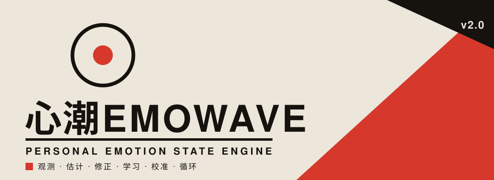

<div align="left">



</div>

# 心潮 EmoWave

> **EmoWave 不替你定义情绪，而是帮你建立一个越来越理解自己的情绪模型。**

`观测 → 估计 → 查看 → 修正 → 学习 → 校准 → 循环`


---

## 01 · 定位

**个人情绪状态引擎**（Personal Emotion State Engine）。维护一条可观察、可编辑、可校准、可学习的连续情绪状态曲线 `E(t) = [V(t), A(t), I(t), S(t)]`，在长期数据积累后形成属于你自己的情绪动态模型。

它**不是**情绪识别器——不武断地告诉你"你现在是什么情绪"。模型永远只是估计，**用户拥有最终解释权**。

**不做什么**：不引入大型本地 LLM 作为运行时依赖；不让 UI / 数据库 / Amiya / 平台实现进入 Core；不训练巨大的情绪识别神经网络。

---

## 02 · 四层架构

```
┌─────────────────────────────────────────────────────────────┐
│  L4  主权层   基线制度 nudge / fork / reset                  │
│               BOCPD 提议 → 用户裁决 → 反哺检测器阈值         │
├─────────────────────────────────────────────────────────────┤
│  L3  学习层   边际似然 + 层次先验收缩 → 个人超参数 θ         │
│               Coactive Learning：拖动当"改进"而非"真值"      │
├─────────────────────────────────────────────────────────────┤
│  L2  回顾层   RTS 平滑（非因果 · O(N) · 全局）              │
│               均值曲线 μ(t) + 置信带 σ(t) + 可拖拽控制点     │
├─────────────────────────────────────────────────────────────┤
│  L1  感知层   因果 Kalman（Matérn ν=3/2 状态空间）          │
│               <0.15ms/步 · O(1) 内存 · 无历史依赖            │
└─────────────────────────────────────────────────────────────┘
```

**核心不变量**：L1 因果滤波在任何设备档位都保留——情绪追踪的核心体验在一切设备上一致。L2/L3/L4 按 Tier 优雅降级。

---

## 03 · 内核地图

```
emowave/                          零第三方依赖 · 纯标准库 · 34 源文件
│
├─ core/
│  ├─ domain/        Observation · EmotionState · UserCorrection
│  │                 Baseline · ModelParameters · StateEvent    （全 frozen）
│  ├─ estimator/     Matérn ν=3/2 状态空间 Kalman（L1）
│  ├─ curve/         RTS 平滑 + 可编辑曲线 + 节点网格（L2）
│  ├─ calibration/   在线岭回归 · 个人超参 · 基线主权（L3+L4）
│  ├─ inference/     个人动态模型 · 趋势预测 + uncertainty
│  ├─ protocol/      Envelope · Amiya 输入输出 · 三版本号
│  ├─ linalg.py      纯标准库矩阵（n×n 求逆，替换 numpy）
│  └─ tier.py        能力分档 T0/T1/T2（低配优雅降级）
│
├─ adapters/         agent/amiya.py（集成桥）· storage/sqlite.py（七表）
└─ cli/              demo · detect · curve · version（Core 脱离 UI 运行）
```

**Core 硬边界**：Core 不知道 PyQt / Flet / Android / iOS / SQLite 实现细节 / Amiya / LLM / TTS。所有跨边界交互经 `adapters/`。

---

## 04 · 关键算法

**Matérn ν=3/2 状态空间**（Hartikainen & Särkkä 2010）——Kalman 是计算后端，高斯过程是数学语义，二者精确等价，复杂度 O(N) 而非 GP 的 O(N³)。

```
λ = √3 / ℓ
F(Δt) = e^(−λΔt) · [ 1+λΔt    Δt   ]
                    [ −λ²Δt   1−λΔt ]
P∞ = σ² · [1  0  ]      Q(Δt) = P∞ − F·P∞·Fᵀ
          [0  λ² ]
```

`ℓ` 即**情绪惯性**（Kuppens 2010）——一个有心理学含义的可学习参数，取代了 1.x `velocity_damping=0.85` 隐含的 ℓ≈11–22s "记忆问题"。恢复半衰期 `t½ ≈ 0.969·ℓ`。

**其余支柱**：RTS 非因果平滑（拖动一点、整条曲线光滑变形）· 峰终加权（Kahneman 1993，回顾编辑按显著性/时近性/心境加权）· 层次先验收缩（Taylor 2017，小样本防过拟合）· Coactive 有界更新（Shivaswamy & Joachims 2015，单次大幅拖动不毁模型）· 在线岭回归（直接补偿系统性残差）。

---

## 05 · 安全与隐私

情绪数据属**高敏感个人状态数据**，默认 **Local-first**。

| 维度 | 保证 |
|---|---|
| 原始数据不可变 | `frozen` dataclass + SQLite `BEFORE UPDATE/DELETE` 触发器**双层强制** |
| 模型结果可重算 | `EmotionState` 可由 `(observations + params)` 完全重建 |
| 用户修正永久保留 | correction append-only，是个人模型的监督信号 |
| SQL 注入 | 全参数化查询（`?` 占位），零字符串拼接 |
| 敏感信息 | 内核零硬编码密钥；日志**不泄露**用户文本与情绪数值 |
| 危险调用 | 无 `eval` / `exec` / `os.system` / `pickle` / `shell=True` |
| 跨线程 | SQLite 连接读写全部串行化（`RLock` + `busy_timeout`） |
| 数据主权 | 用户拥有导出 / 删除 / 重置；可关闭 EmoWave→Amiya 共享 |

> 经 `diegosouzapw-analyze-code` 独立审查：无 CRITICAL，核心数学逐行核对正确；已修复 1 HIGH（NaN/Inf 输入硬化）+ 2 MEDIUM（基线编辑守卫、SQLite 线程安全）。详见 [`REFACTOR_PROGRESS.md`](REFACTOR_PROGRESS.md)。

---

## 06 · 优雅降级

**任何可选能力都必须能够失效而不摧毁核心系统。**

```
EmoWave without Amiya   ✅   内核完整独立运行
Amiya without EmoWave   ✅   回退关键词规则分类
EmoWave + Amiya         ✅   连续模型推断，下游零改动
```

四级降级：L0 启动期未安装静默回退 · L1 配置期 `EMOWAVE_ENABLED=0` 默认关闭 · L2 运行期异常捕获回退绝不上抛 · L3 能力期低配/省电按 Tier 降档。

---

## 07 · 性能

低配置电脑和手机也能实时运行。纯 Python 内核实测：

| 指标 | 实测 | 目标 |
|---|---:|---:|
| L1 因果滤波单步 | **0.148 ms** | < 20 ms |
| L1 @ 1Hz CPU 占用 | **0.015 %** | — |
| RTS 节点网格降采样 | **6.1× 加速** | part2 §2.4 |
| 曲线重建（T1 档） | **149 ms** | ≤ 150 ms |
| GPU 依赖 | **无** | 不要求 |

RMSE 对照：新 Matérn 估计器全局优于旧 Kalman（0.053 vs 0.065），**观测缺失区域改善 27.2%**——证实"记忆问题"修复有效。

---

## 08 · 快速开始

```bash
# 零运行时依赖（仅标准库），Python 3.9+
python -m emowave.cli version          # 版本 + 协议 schema + 探测档位
python -m emowave.cli demo --points 60 # 合成观察流 → 实时状态估计
python -m emowave.cli detect --text "我好焦虑"
python -m emowave.cli curve --points 60 --nodes 15   # RTS 曲线 + 置信带
```

```python
from emowave import Observation
from emowave.core.estimator.estimator import StateEstimator

est = StateEstimator()
est.initialize(timestamp=1000.0, valence=0.5, arousal=0.5)
for i in range(60):
    state = est.update(Observation(timestamp=1000.0 + i, valence=0.6, arousal=0.4))
    # state.valence · state.arousal · state.intensity · state.confidence · state.trend
```

---

## 09 · 测试与质量

**606 个测试全通过**（564 内核 + 30 旧回归 + 12 安全审查回归），TDD 全程：写测试 → 看失败 → 最小实现 → 看通过 → 重构。

```bash
python -m pytest emowave/tests/ -v   # 564 内核测试
python -m pytest tests/ test_engine.py -v  # 旧桌面应用回归
```

覆盖：领域模型不变式 · Matérn 闭式解数学性质 · RTS 优于滤波 · 可编辑曲线不发散 · 个人学习"修正越多误差下降" · 基线主权 · 双向降级 · SQLite 不可变与并发 · CLI。

---

## 10 · 与 Amiya 的关系

```
EmoWave = State Engine      "用户现在大概处于什么状态？"
Amiya   = Companion Agent   "我应该怎样理解、回应和陪伴？"
```

EmoWave 作为 Amiya 的**可选外部状态引擎**，不反向依赖 Amiya。Amiya 侧只需 `from emowave import EmotionBridge`，即可从"关键词猜"升级为"连续效价-唤醒模型推断"，下游提示词注入 / 皮肤联动零改动。

---

## 11 · 多平台路线

| 阶段 | 目标 | 状态 |
|---|---|---|
| 一 | Python Core + 算法/数据模型做正确 | ✅ Phase 0–9 完成 |
| 二 | Flet 跨平台 UI（Win/Linux/macOS/Android/iOS） | 后续（需 `flet`） |
| 三 | 可选 Rust Core（Python 作 Reference，golden test 对齐） | 预留 |

---

## 12 · 回滚与许可

1.x 稳定版锚定 tag **`v1.0-stable`**，随时 `git reset --hard v1.0-stable` 退回。2.0 重构在 `refactor/v2-core` 分支，逐阶段提交。

**MIT** · 完整重构执行日志见 [`REFACTOR_PROGRESS.md`](REFACTOR_PROGRESS.md)，架构依据 `EMOWAVE_REFACTOR_PLAN.md` 与 `ARCHITECTURE_*` 文档。

---

■ 心潮 EmoWave · Personal Emotion State Engine · v2.0
