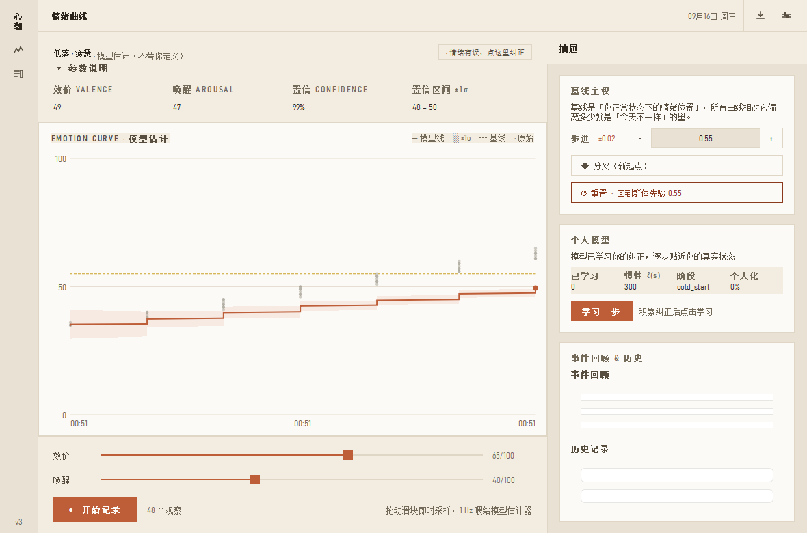
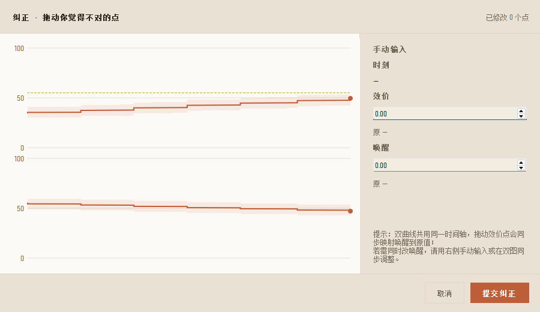

<div align="left">


</div>

# 心潮 EmoWave

> **EmoWave 不替你定义情绪，而是帮你建立一个越来越理解自己的情绪模型。**

`选人群 → 观测 → 估计 → 查看 → 修正 → 学习 → 校准 → 循环`


---

## 01 · 定位

**个人情绪状态引擎**（Personal Emotion State Engine）。维护一条可观察、可编辑、可校准、可学习的连续情绪状态曲线 `E(t) = [V(t), A(t), I(t), S(t)]`，在长期数据积累后形成属于你自己的情绪动态模型。

它**不是**情绪识别器——不武断地告诉你"你现在是什么情绪"。模型永远只是估计，**用户拥有最终解释权**。

**不做什么**：不引入大型本地 LLM 作为运行时依赖；不让 UI / 数据库 / Amiya / 平台实现进入 Core；不训练巨大的情绪识别神经网络；**不在后台常驻运行**（情绪推演只在窗口打开时按前台心跳推进）。

---

## 02 · 精力人群先验与情绪波（v3 交互主线）

**开局选一类人群，得到一条默认曲线；记录一次情绪，画出一个会自己收回基线的"波"。**

**三类精力人群先验**（`emowave/core/domain/archetype.py`）——把人群按精力分为高 / 中 / 低，各配一条默认曲线函数（Matérn GP 的 `ℓ 惯性 · σ 幅度 · 基线中心`）。精力≈唤醒：

| 人群 | 基线唤醒 | σ 幅度 | ℓ 惯性 | 直观感受 |
|---|---|---|---|---|
| 高精力 | 高（0.60） | 大 | 短（180/240s） | 起得快、落得也快 |
| 中精力 | 中（0.42，=群体先验） | 中 | 中（240/300s） | 默认 |
| 低精力 | 低（0.25） | 小 | 长（320/380s） | 更平、更缓 |

**情绪波生命周期**（主界面曲线，非开机常驻）：

```
idle（开始记录） → recording（1Hz 采样记录中）
   → 停止 → decaying（按模型惯性向基线外推衰减，实时"慢慢推演"）
   → 回归基线平稳 → 曲线消失 → idle（等待下一次记录）
```

- 停止记录后曲线不清空，而是**向基线（一开始的平均值）外推衰减**，回归平稳即消失——一次记录=一个情绪事件。
- **无后台进程**：衰减只在窗口打开时由前台 1Hz 心跳推进；关闭时把未走完的波存进本地库，**下次启动自动重放推演**。
- 附带性质：高精力一波回归更快、低精力更慢（与人群先验自洽）。
- 个性化学习**向所选人群的先验收缩**（不再是单一全局先验）——换人群，学习回归的目标也随之改变。

---

## 03 · 四层架构

```
┌─────────────────────────────────────────────────────────────┐
│  L4  主权层   基线制度 nudge / fork / reset                  │
│               BOCPD 提议 → 用户裁决 → 反哺检测器阈值         │
├─────────────────────────────────────────────────────────────┤
│  L3  学习层   边际似然 + 层次先验收缩 → 个人超参数 θ         │
│               收缩锚 = 所选精力人群先验（非单一全局先验）    │
│               Coactive Learning：拖动当"改进"而非"真值"      │
├─────────────────────────────────────────────────────────────┤
│  L2  回顾层   RTS 平滑（非因果 · O(N) · 全局）              │
│               均值曲线 μ(t) + 置信带 σ(t) + 可拖拽控制点     │
├─────────────────────────────────────────────────────────────┤
│  L1  感知层   因果 Kalman（Matérn ν=3/2 状态空间）          │
│               起点 = 所选人群先验 · <0.15ms/步 · O(1) 内存   │
└─────────────────────────────────────────────────────────────┘
```

**核心不变量**：L1 因果滤波在任何设备档位都保留——情绪追踪的核心体验在一切设备上一致。L2/L3/L4 按 Tier 优雅降级。

---

## 04 · 内核地图

```
emowave/                          零第三方依赖 · 纯标准库 · pip 可安装
│
├─ core/
│  ├─ domain/        Observation · EmotionState · UserCorrection
│  │                 Baseline · ModelParameters · StateEvent    （全 frozen）
│  │                 archetype.py  高/中/低精力人群先验（默认曲线函数）
│  ├─ estimator/     Matérn ν=3/2 状态空间 Kalman（L1）
│  ├─ curve/         RTS 平滑 + 可编辑曲线 + 节点网格（L2）
│  ├─ calibration/   在线岭回归 · 个人超参（锚=人群先验） · 基线主权（L3+L4）
│  ├─ inference/     个人动态模型 · 趋势预测 + uncertainty
│  ├─ protocol/      Envelope · Amiya 输入输出 · 三版本号
│  ├─ linalg.py      纯标准库矩阵（n×n 求逆，替换 numpy）
│  └─ tier.py        能力分档 T0/T1/T2（低配优雅降级）
│
├─ adapters/         agent/amiya.py（集成桥）· storage/sqlite.py（七表）
└─ cli/              demo · detect · curve · version（Core 脱离 UI 运行）
```

**Core 硬边界**：Core 不知道 PyQt / Flet / Android / iOS / SQLite 实现细节 / Amiya / LLM / TTS。所有跨边界交互经 `adapters/`。

---

## UI 预览（v3 实拍 · PyQt5 桌面端）

> **左 56px 图标列**（心潮字标 + 曲线 / 抽屉两个动作，当前视图高亮）→ **中部主界面**（状态 · 读数 · 曲线 · 输入四区块）→ **右侧抽屉**（基线主权 · 个人模型 · 事件回顾与历史记录）。开局弹出"选精力人群"，页头可随时重选。
> 构成主义骨架（大块面 · 不对称 · 硬边直角 · 粗无衬线） + 暖色板（暖黄纸底 · 陶土赭红 · 低饱和 · 单一色相）。

| 01 · 主界面（情绪曲线） | 02 · 右侧抽屉（可滚动） | 03 · 纠正上滑框（双曲线拖点 + 手动输入） |
|:---:|:---:|:---:|
|  |  |  |

> 设计稿（HTML 模拟）：[`docs/ui-draft-v1.html`](docs/ui-draft-v1.html) · 调研依据：[`docs/UI_PREFLIGHT_视觉传达与UI设计调研.md`](docs/UI_PREFLIGHT_视觉传达与UI设计调研.md) · 设计令牌：[`theme.py`](theme.py)

**桌面端结构**（PyQt5，与内核解耦，`emowave/` 不反向依赖任何 UI 代码）：

```
main_app.py            外壳 · 56px 图标列 + 极简页头（无菜单栏）· HighDPI 前置
│                      开局选精力人群 + 页头"精力·X ▾"随时重选
├─ theme.py            设计令牌 + 一份 app 级 QSS（修 QSS 不继承 font/color）
├─ curve_widget.py     曲线 · 双序列 · 单次描边 · 时间轴按跨度自适应（短记录显示到秒）
└─ windows/
   ├─ main_console.py       主界面 4 区块 + 情绪波生命周期（记录→衰减回基线→消失）
   ├─ archetype_dialog.py   开局/重选"高·中·低精力"人群
   ├─ drawer.py             右侧滑出抽屉（maximumWidth 动画 + 内容可滚动）
   ├─ baseline_tools.py     基线主权：步进 ±0.02 · ◆ 分叉 · ↺ 重置
   ├─ model_card.py         个人模型：学习进度 · 惯性 ℓ · 阶段
   ├─ legacy_embed.py       事件回顾 · 历史记录（注入 db，可刷新）
   ├─ event_detail_dialog.py 补全/修正事件：触发·躯体·应对·自评
   └─ correction_sheet.py + correction_canvas.py   底部上滑纠正框（双曲线拖点 + 手动输入）
```

**事件补全/修正窗口**：记录产生的事件里"触发因素 / 躯体症状 / 自评峰值"默认留空，事件回顾面板有「补全/修正」按钮、历史记录双击某行即可打开同一窗口补录（只更新可补全字段，保留事件原始时间）。

**这一路修掉的关键问题**：

| 问题 | 根因 | 修法 |
|---|---|---|
| 侧栏两个按钮点不进去 | 曲线按钮未接 `clicked`；`setFixedWidth` 钉死 `minimumWidth` 使抽屉收放动画失效 | 接处理 + 抽屉 `minimumWidth=0` + 内层固定宽容器 |
| 事件回顾/历史永远空壳 | `session=None` 未注入 + 从不 `refresh` + v3 记录从不写事件表 | 注入 db + 开抽屉/停记录刷新 + 停止记录聚合落库 |
| 时间轴看着卡死 | 刻度只到分钟，短记录三刻度同值 | 按可见跨度自适应（短→显示到秒）+ 多刻度 |
| 抽屉底部内容够不着 | 无滚动条，内容高于视口被裁 | 抽屉 body 包 `QScrollArea` |
| 改点不重拟合曲线 | 界面画因果 Kalman，纠正只入队 | 显示曲线改 RTS 平滑，纠正作伪观察即时重拟合 |
| 1px 发丝线糊 / 廉价感 / 拐点串珠 | HighDPI 未前置 / 逐控件 QSS / 逐段 drawLine | 前置 HighDPI + 一份 app 级 QSS + 单次 `QPainterPath` |

实测 n=20000 平滑数据单次渲染 **14.7 ms**（目标 ≤149 ms）。

---

## 05 · 关键算法

**Matérn ν=3/2 状态空间**（Hartikainen & Särkkä 2010）——Kalman 是计算后端，高斯过程是数学语义，二者精确等价，复杂度 O(N) 而非 GP 的 O(N³)。

```
λ = √3 / ℓ
F(Δt) = e^(−λΔt) · [ 1+λΔt    Δt   ]
                    [ −λ²Δt   1−λΔt ]
P∞ = σ² · [1  0  ]      Q(Δt) = P∞ − F·P∞·Fᵀ
          [0  λ² ]
```

`ℓ` 即**情绪惯性**（Kuppens 2010）——一个有心理学含义的可学习参数。恢复半衰期 `t½ ≈ 0.969·ℓ`。

**情绪波衰减回基线**：停止记录后，位置按 Matérn 衰减因子 `d(Δt)=e^(−λΔt)(1+λΔt)` 在**偏离空间**向基线（GP 均值函数）外推——注意不是向 0 收，所以曲线收回的是"你的正常值"。

**其余支柱**：RTS 非因果平滑（拖动一点、整条曲线光滑变形）· 峰终加权（Kahneman 1993）· 层次先验收缩（Taylor 2017，**锚点=所选人群先验**）· Coactive 有界更新（Shivaswamy & Joachims 2015）· 在线岭回归（补偿系统性残差）。

---

## 06 · 安全与隐私

情绪数据属**高敏感个人状态数据**，默认 **Local-first**。

| 维度 | 保证 |
|---|---|
| 原始数据不可变 | `frozen` dataclass + SQLite `BEFORE UPDATE/DELETE` 触发器**双层强制** |
| 模型结果可重算 | `EmotionState` 可由 `(observations + params)` 完全重建 |
| 用户修正永久保留 | correction append-only，是个人模型的监督信号 |
| SQL 注入 | 全参数化查询（`?` 占位）；补全事件的 `update_event` 仅拼白名单列名 |
| 敏感信息 | 内核零硬编码密钥；日志**不泄露**用户文本与情绪数值 |
| 危险调用 | 无 `eval` / `exec` / `os.system` / `pickle` / `shell=True` |
| 跨线程 | SQLite 连接读写全部串行化（`RLock` + `busy_timeout`） |
| 数据主权 | 用户拥有导出 / 删除 / 重置；可关闭 EmoWave→Amiya 共享 |

> 经 `diegosouzapw-analyze-code` 独立审查 + 两轮 `p3c-code-quality`（按 Python 适配）：无 CRITICAL，核心数学逐行核对正确；已修 NaN/Inf 硬化、SQLite 线程安全、空 catch 改日志等。详见 [`REFACTOR_PROGRESS.md`](REFACTOR_PROGRESS.md) 与 [`docs/测试报告/`](docs/测试报告/)。

---

## 07 · 优雅降级

**任何可选能力都必须能够失效而不摧毁核心系统。**

```
EmoWave without Amiya   ✅   内核完整独立运行
Amiya without EmoWave   ✅   回退关键词规则分类
EmoWave + Amiya         ✅   连续模型推断，下游零改动
无 PyQt5 / 无本地库     ✅   核心引擎与 CLI 照常运行；主界面可脱库启动
```

四级降级：L0 启动期未安装静默回退 · L1 配置期 `EMOWAVE_ENABLED=0` 默认关闭 · L2 运行期异常捕获回退绝不上抛 · L3 能力期低配/省电按 Tier 降档。

---

## 08 · 性能

低配置电脑和手机也能实时运行。纯 Python 内核实测：

| 指标 | 实测 | 目标 |
|---|---:|---:|
| L1 因果滤波单步 | **0.148 ms** | < 20 ms |
| L1 @ 1Hz CPU 占用 | **0.015 %** | — |
| RTS 节点网格降采样 | **6.1× 加速** | part2 §2.4 |
| 曲线重建（T1 档） | **149 ms** | ≤ 150 ms |
| GPU 依赖 | **无** | 不要求 |

RMSE 对照：新 Matérn 估计器全局优于旧 Kalman（0.053 vs 0.065），**观测缺失区域改善 27.2%**。

---

## 09 · 快速开始

**作为 pip 包安装内核（零依赖）：**

```bash
pip install emowave                      # 或从 Release 下载 emowave-3.0.0-py3-none-any.whl
emowave version                          # 版本 + 协议 schema + 探测档位
emowave demo --points 60                 # 合成观察流 → 实时状态估计
emowave detect --text "我好焦虑"
emowave curve --points 60 --nodes 15     # RTS 曲线 + 置信带
```

**桌面 GUI（PyQt5 5.15+，可选）：**

```bash
pip install "emowave[gui]"               # 或 pip install PyQt5
python main_app.py                       # 源码运行；Windows 可双击 run_emowave.bat
```

```python
from emowave import Observation, get_archetype
from emowave.core.estimator.estimator import StateEstimator

prior = get_archetype("high")            # 选一类精力人群先验作起点
est = StateEstimator(params=prior.to_params(), baseline=prior.to_baseline())
est.initialize(timestamp=1000.0, valence=0.5, arousal=0.5)
for i in range(60):
    state = est.update(Observation(timestamp=1000.0 + i, valence=0.6, arousal=0.4))
    # state.valence · state.arousal · state.intensity · state.confidence · state.trend
```

---

## 10 · 测试与质量

**642 个测试全通过**（内核 `emowave/tests/` 587 + 桌面端 `tests/` 55；另有 `test_engine.py` 等 1.x 回归），TDD 全程：写测试 → 看失败 → 最小实现 → 看通过 → 重构。

```bash
python -m pytest emowave/tests/ -v       # 587 内核测试
python -m pytest tests/ -v               # 55 桌面端集成测试
```

覆盖：领域模型不变式 · Matérn 闭式解数学性质 · RTS 优于滤波 · 可编辑曲线不发散 · 精力人群先验与锚点收缩 · 情绪波衰减回基线 · 事件落库与补全 · 基线主权 · 双向降级 · SQLite 不可变与并发 · CLI。

---

## 11 · 与 Amiya 的关系

```
EmoWave = State Engine      "用户现在大概处于什么状态？"
Amiya   = Companion Agent   "我应该怎样理解、回应和陪伴？"
```

EmoWave 作为 Amiya 的**可选外部状态引擎**，不反向依赖 Amiya。Amiya 侧只需 `from emowave import EmotionBridge`，即可从"关键词猜"升级为"连续效价-唤醒模型推断"，下游提示词注入 / 皮肤联动零改动。

---

## 12 · 版本与许可

- **v3.0.0**（当前）：PyQt5 桌面端成型 —— 精力人群先验、情绪波生命周期、事件补全窗口、人群锚定的个性化学习、内核 pip 包 + GitHub Release。下载见 [Releases](https://github.com/x7687315-gif/emowave-engine/releases/tag/v3.0.0)。
- 内核 2.0 重构 Phase 0–9 已完成并并入 `main`；1.x 稳定版锚定 tag **`v1.0-stable`**，随时可回退。
- 功能分支均已合并回 `main` 并清理。

**MIT** · 完整重构执行日志见 [`REFACTOR_PROGRESS.md`](REFACTOR_PROGRESS.md)，架构依据 `EMOWAVE_REFACTOR_PLAN.md` 与 `ARCHITECTURE_*` 文档。

---

■ 心潮 EmoWave · Personal Emotion State Engine · v3.0.0
