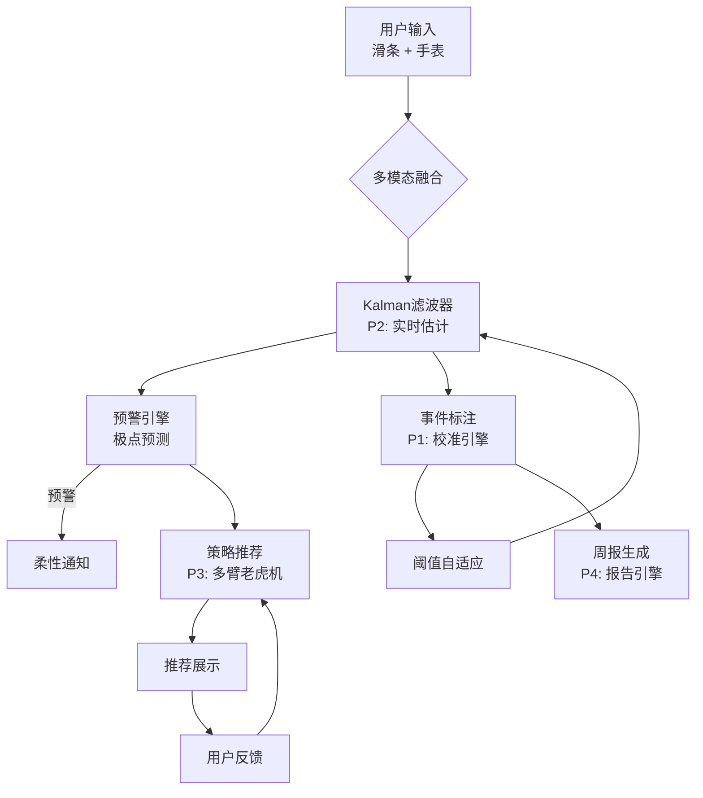

# 心潮 EmoWave 技术白皮书

**EmoWave Engine -- 基于卡尔曼滤波与上下文老虎机的个人情绪校准系统**

---

**版本**: 1.0  
**日期**: 2026-07-09  
**状态**: 技术初稿（供内部评审与合作方交流）

---

## 文档元信息

| 项目 | 内容 |
|------|------|
| 项目名称 | 心潮 EmoWave |
| 核心技术 | 自适应卡尔曼滤波 + LinUCB 上下文老虎机 + 贝叶斯基线漂移检测 |
| 目标平台 | iOS / Android（设备端本地推理） |
| 文档类型 | 技术白皮书 |
| 生成时间 | 2026-07-09 |
| 系统参数来源 | 实时读取自系统配置对象 |


## 1. 概述

### 1.1 项目目标

心潮 EmoWave 是一个**设备端优先**的个人情绪校准与预警系统。本项目的核心目标是构建一套能够：

1. **实时估计**用户的情绪状态（效价-唤醒二维空间中的连续轨迹）
2. **提前预警**情绪即将进入危险区域，给用户留出宝贵的反应时间
3. **个性化推荐**情境感知的应对策略，并通过在线学习持续优化
4. **自适应校准**阈值与基线，从群体通用值渐进过渡到个人化模型
5. **保护隐私**，所有数据默认驻留设备本地，用户拥有完全的数据控制权

### 1.2 核心理念

> **情绪是变化的曲线，而非离散的标签。**

传统情绪应用通常要求用户在几个离散标签中选择当前的"心情"，例如"开心""焦虑""悲伤"。这种方法存在两个根本问题：

- **粒度丢失**："焦虑"与"愤怒"的生理表现和应对策略截然不同，却被简化为同一类别
- **时间维度缺失**：情绪是随时间连续变化的，离散采样无法捕捉转折点

EmoWave 采用**维度情绪模型**（效价-唤醒二维空间），通过连续滑条交互捕捉情绪的动态轨迹，并利用卡尔曼滤波器在稀疏观测间进行最优插值，从而获得每秒级别的情绪状态估计。

### 1.3 目标用户

- **高压力职场人群**：需要持续管理压力的职场人士
- **情绪困扰的年轻人**：寻求自我觉察与情绪管理工具的年轻人
- **心理健康关注者**：希望科学量化自身情绪模式的普通用户
- **临床辅助场景**：作为心理咨询的辅助工具，帮助治疗师了解来访者的日常情绪动态

### 1.4 与传统方案的差异

| 维度 | 传统情绪应用 | EmoWave |
|------|-------------|---------|
| 情绪表示 | 离散标签（5-7类） | 二维连续空间（效价-唤醒） |
| 采样频率 | 每天 1-3 次 | 实时滑条 + 手表传感器（~1Hz） |
| 信号处理 | 简单统计 | 卡尔曼滤波（递归贝叶斯最优估计） |
| 预警机制 | 事后回顾 | 基于轨迹外推的提前预警 |
| 策略推荐 | 静态列表 | LinUCB 上下文老虎机（在线学习） |
| 个性化 | 无或极少 | 冷启动 → 混合 → 纯个人三阶段自适应 |
| 数据存储 | 云端集中 | 设备端本地优先 |


## 2. 理论基础

### 2.1 维度情绪模型

#### 2.1.1 Russell 环状模型（Circumplex Model）

本系统的核心理论框架基于 James A. Russell (1980) 提出的**情绪环状模型**。该模型将情绪映射到二维空间：

- **效价（Valence）**：水平轴，从"极度不适"（0）到"极度舒适"（1）
- **唤醒（Arousal）**：垂直轴，从"极困倦"（0）到"极兴奋"（1）

常见的"基本情绪"在二维空间中的近似位置如下：

| 情绪 | 效价 (V) | 唤醒 (A) | 象限 |
|------|---------|---------|------|
| 兴奋 | 高 | 高 | Q1（高效价高唤醒） |
| 焦虑 | 低 | 高 | Q2（低效价高唤醒）*危险区* |
| 悲伤 | 低 | 低 | Q3（低效价低唤醒） |
| 平静 | 高 | 低 | Q4（高效价低唤醒） |

#### 2.1.2 强度的几何定义

我们定义**情绪强度**为状态向量在二维空间中的欧几里得范数：

```
intensity = sqrt(valence^2 + arousal^2) / sqrt(2)
```

该定义将强度归一化到 [0, 1] 区间：
- 原点 (0,0) 对应强度 0
- 远端角 (1,1) 对应强度 1
- 强度的时间导数 intensity_dot 反映情绪的加速/减速趋势

**危险区**定义为：`valence < high_risk_valence AND arousal > high_risk_arousal`，即"高唤醒 + 低效价"象限的极端区域。当前系统默认的群体阈值为 arousal > 0.85、valence < 0.15。

### 2.2 生态瞬时评估（EMA）

#### 2.2.1 信号检测与反应偏差理论

生态瞬时评估（Ecological Momentary Assessment, EMA）是 Shiffman 等人 (2008) 系统化的方法论，主张在自然生活情境中反复采集被试的即时状态。传统 EMA 通常通过定时问卷实现，存在以下局限：

- **反应偏差**：用户回忆和自我报告受当时认知状态影响
- **采样稀疏**：每天 5-10 次的采样频率无法捕捉情绪的快速变化
- **二元化倾向**：问卷答案的离散选项会人为地将连续变量离散化

#### 2.2.2 滑条交互作为连续信号采集

EmoWave 将 EMA 升级为**连续信号采集范式**：

1. 用户通过滑条实时报告效价和唤醒值，产生约 1Hz 的连续采样流
2. 滑条的操作本身被视为一个**"人在回路"的测量系统**：
   - 积极拖动时（高 touch_velocity）：用户处于元认知监控状态，信号可靠性高
   - 长时间静止后跳变：可能是回顾性补录或误触，信号可靠性低
3. 卡尔曼滤波器的自适应噪声机制根据交互行为动态调整对每个采样点的信任度

### 2.3 情感计算

#### 2.3.1 多模态融合（主观 + 生理）

系统融合两种信号源：

- **主观信号**：滑条报告的效价与唤醒值
- **生理信号**：来自智能手表的心率（HR）和心率变异性（HRV）

生理信号不直接用于情绪分类，而是作为**控制输入**融入状态转移模型：
- HRV 下降（交感神经激活的标志）被映射为唤醒变化率的先验
- 心率激增（z-score 超过阈值）作为生理极点的辅助证据
  - 当前 HRV 控制权重: 0.3
  - 当前 HR 控制权重: 0.2

#### 2.3.2 实时估计与预测

情感计算的最终目标不仅是"识别当前情绪"，更是"预测未来走向"。EmoWave 通过卡尔曼滤波器的状态转移模型（含速度维度）实现：

1. **实时状态估计**：每收到一个观测，滤波器递归更新状态估计
2. **轨迹外推**：利用当前速度估计，外推未来最多 600 秒（10 分钟）的情绪轨迹
3. **极点预警**：检查外推轨迹是否进入危险区，计算最优预警提前量


## 3. 系统架构

### 3.1 四大核心模块

EmoWave 由四个核心模块组成，形成完整的数据处理闭环：

| 模块 | 对应文件 | 职责 |
|------|---------|------|
| **P1: 校准引擎** | `engine.py` + `annotator.py` | 事件标注、基线管理、阈值自适应 |
| **P2: 实时估计器** | `kalman_filter.py` | 卡尔曼滤波、多模态融合、轨迹外推 |
| **P3: 预警与推荐** | `predictor.py` + `recommender.py` | 极点预警、策略推荐（LinUCB） |
| **P4: 报告引擎** | `report_generator.py` | 周报/月报生成、趋势分析 |

### 3.2 架构流程图

#### Mermaid 流程图



#### ASCII 架构图（备选渲染）

```
  +-------------------+       +-------------------+
  |    用户输入        |       |    生理信号        |
  |  (滑条效价/唤醒)   |       |  (手表 HR/HRV)    |
  +--------+----------+       +--------+----------+
           |                           |
           v                           v
  +--------------------------------------------------+
  |        P2: 自适应卡尔曼滤波器                      |
  |  状态向量: [valence, arousal, d_v, d_a]           |
  |  自适应观测噪声 + 生理控制输入                     |
  +---+----------------+-------------------+----------+
      |                |                   |
      v                v                   v
  +--------+   +-------------+   +-----------------+
  | 轨迹外推 |   | P1: 事件标注 |   | P3: 策略推荐   |
  +----+---+   +------+------+   +--------+--------+
       |              |                    |
       v              v                    v
  +--------+   +------+------+   +--------+--------+
  | 预警引擎 |   | 阈值自适应   |   | LinUCB 老虎机  |
  +----+---+   +------+------+   +--------+--------+
       |              |                    |
       v              v                    v
  +--------+   +------+------+   +--------+--------+
  | 柔性通知 |   | 基线漂移检测 |   |  用户反馈评分  |
  +--------+   +-------------+   +-----------------+
                                     |
                                     v
                              +-------------+
                              | P4: 周报生成 |
                              +-------------+
```

### 3.3 数据流向说明

#### 实时数据流（秒级）

1. 用户拖动滑条 → 生成 `SliderObservation`（valence, arousal, touch_velocity）
2. 手表蓝牙传输 → 生成 `PhysioInput`（hrv_drop_ratio, hr_change, signal_quality）
3. 卡尔曼滤波器接收上述信号 → 输出 `EmotionState`（平滑后的状态估计）
4. 预警引擎检查状态 → 若需要则触发预警通知

#### 事件级数据流（分钟-小时级）

1. 用户点击"已平静" → 汇总本事件所有时序采样为 `EmotionEventRaw`
2. 校准引擎（P1）处理事件：
   - 自动标注极点、危险段、恢复特征 → `EventProfile`
   - 更新阈值管理器 → `PersonalThresholds`
3. 用户对推荐策略评分 → LinUCB 老虎机更新参数

#### 日级数据流（每日一次）

1. 汇总当日所有事件 → `DailySummary`
2. 基线管理器 EWMA 更新 → `BaselineVector`
3. 漂移检测 → 若异常则生成 `BaselineShiftEvent`
4. 周报引擎生成可视化报告


## 4. 核心算法

### 4.1 自适应卡尔曼滤波器

#### 4.1.1 算法选择理由

我们选择卡尔曼滤波器（Kalman Filter）作为核心状态估计器，基于以下考量：

| 需求 | 卡尔曼滤波器的优势 |
|------|-------------------|
| 实时递归更新 | O(n^2) 复杂度，n=4 时计算量极低，适合移动设备 |
| 不确定性量化 | 协方差矩阵自然给出估计的置信区间 |
| 多源融合 | 通过控制输入和自适应噪声权重优雅融合主观与生理信号 |
| 短期预测 | 状态转移模型（含速度维度）支持轨迹外推 |
| 稀疏观测处理 | 在两次观测间利用惯性预测填补空白 |

#### 4.1.2 状态向量定义

```
x = [valence, arousal, d_valence/dt, d_arousal/dt]^T
```

状态向量为 4 维：
- **位置分量**：valence（效价）和 arousal（唤醒），范围 [0, 1]
- **速度分量**：d_valence/dt 和 d_arousal/dt，即效价和唤醒的变化率

速度维度的存在是关键设计：它使滤波器能够"理解"情绪的惯性趋势，从而在观测缺失期间（如用户暂时没有操作滑条）进行有意义的轨迹预测。

#### 4.1.3 过程模型（阻尼速度模型）

状态转移方程（离散化匀速运动模型）：

```
x[k+1] = F * x[k] + w,  w ~ N(0, Q)

F = | 1  0  dt  0 |    位置 = 旧位置 + 速度 * dt
    | 0  1  0   dt |
    | 0  0  1   0 |    速度保持不变 + 过程噪声
    | 0  0  0   1 |
```

**过程噪声协方差 Q 的参数**（从系统配置实时读取）：

| 参数 | 当前值 | 含义 |
|------|-------|------|
| q_position_std | 0.02 | 效价/唤醒位置噪声标准差 |
| q_velocity_std | 0.06 | 效价/唤醒速度噪声标准差 |
| velocity_damping | 0.85 | 速度阻尼因子（每秒保留 85% 的速度） |

**速度阻尼设计**：

情绪变化不像物理运动那样具有惯性。用户对滑条的操作更接近"瞬态控制"，上一秒的速度不应强烈影响下一秒。因此我们在每次更新后对速度维度施加阻尼：

```
velocity *= 0.85  // 每秒保留 85% 的速度
```

#### 4.1.4 观测模型（自适应噪声）

观测方程：

```
z = H * x + v,  v ~ N(0, R)

H = | 1  0  0  0 |    观测到位置，不观测速度
    | 0  1  0  0 |
```

**自适应观测噪声 R**根据用户交互行为动态调整：

| 交互类型 | 判定条件 | 噪声标准差 | 理由 |
|---------|---------|-----------|------|
| 快速移动 | touch_velocity > 0.3 | R_fast = 0.04 | 用户积极控制，信号可靠 |
| 静止跳变 | 停顿 > 3s 后突变 | R_jump = 0.25 | 可能是误触或延迟补录 |
| 正常交互 | 其他情况 | R_base = 0.08 | 默认噪声水平 |

#### 4.1.5 生理信号作为控制输入

当手表连接时，HRV 变化和心率变化被映射为唤醒变化率的先验：

```
control_arousal = w_hrv * hrv_drop_ratio + w_hr * hr_change / 100
// 当前权重: w_hrv = 0.3, w_hr = 0.2
```

信号质量低时（signal_quality < 0.5），过程噪声 Q 会被放大（最高 3 倍），使滤波器更依赖主观滑条而非不可靠的生理数据。

#### 4.1.6 预警外推机制

预警引擎从当前状态出发，利用状态转移模型进行纯预测迭代（不融入观测），生成未来 600 秒（10 分钟）的情绪轨迹。外推过程结束后恢复滤波器内部状态，不影响后续估计。

---

### 4.2 多臂老虎机（LinUCB）

#### 4.2.1 算法选择理由

策略推荐问题天然适合建模为"上下文多臂老虎机"问题：

- **探索-利用平衡**：新策略需要被尝试（探索），已验证的策略应优先推荐（利用）
- **情境感知**：不同情绪状态下，同一策略的效果差异显著
- **在线学习**：无需离线训练，随用户使用自然积累个性化知识
- **设备端运行**：纯线性模型，无需 GPU，适合移动端

#### 4.2.2 线性模型

LinUCB 对每个策略（"臂"）维护一个线性模型：

```
expected_reward = theta^T * x + alpha * sqrt(x^T * A^{-1} * x)
                   |----- 预测 -----|   |---- 不确定性 ----|
```

其中：
- `theta = A^{-1} * b`：当前最优系数向量
- `A`：d x d 共轭先验矩阵（d=10）
- `b`：d x 1 奖励累积向量
- `alpha`：探索系数，控制探索-利用权衡
- `x`：10 维情境特征向量

UCB 分数 = 预测奖励 + 探索奖励。新策略因 A 接近单位矩阵，不确定性项大，自动获得较高的探索分数。

#### 4.2.3 特征工程（10 维特征向量）

| 维度 | 特征 | 归一化 |
|------|------|--------|
| 1 | current_valence | [0, 1] 原始 |
| 2 | current_arousal | [0, 1] 原始 |
| 3 | time_of_day | / 24.0 |
| 4 | weekday | / 6.0 |
| 5 | last_sleep_score | / 10.0 |
| 6 | trigger_category_code | / 10.0 |
| 7 | sin(weekday * 2pi/7) | 周期性编码 |
| 8 | cos(weekday * 2pi/7) | 周期性编码 |
| 9 | sin(hour * 2pi/24) | 周期性编码 |
| 10 | cos(hour * 2pi/24) | 周期性编码 |

维度 7-10 使用三角函数编码捕捉星期和小时的周期性，避免"周一=0, 周日=6"这类线性编码导致的周日-周一不连续问题。

#### 4.2.4 当前策略库

系统预设了 10 个应对策略，分为 4 个类别：

| 策略 ID | 名称 | 类别 |
|---------|------|------|
| deep_breathing | 深呼吸练习 | breathing |
| body_scan | 身体扫描放松 | breathing |
| short_walk | 短暂散步 | physical |
| stretching | 拉伸运动 | physical |
| listen_music | 听音乐 | cognitive |
| journaling | 情绪日记书写 | cognitive |
| cold_water | 冷水洗脸 | sensory |
| talk_friend | 联系朋友聊天 | social |
| progressive_relax | 渐进式肌肉放松 | breathing |
| grounding_543 | 5-4-3-2-1 接地练习 | cognitive |

---

### 4.3 基线建模与漂移检测

#### 4.3.1 基线向量定义

用户的"静息基线"由 5 个维度构成：

| 维度 | 含义 | 默认值 |
|------|------|--------|
| resting_hrv_mean | 静息 HRV 均值 (ms) | 50.0 |
| resting_hr | 静息心率 (BPM) | 72.0 |
| sleep_score | 前夜睡眠评分 (0-10) | 7.0 |
| typical_valence_8am | 早间典型效价 | 0.55 |
| typical_valence_6pm | 晚间典型效价 | 0.50 |

#### 4.3.2 EWMA 更新策略

基线使用指数加权移动平均（EWMA）每日更新：

```
baseline_new = alpha * x_new + (1 - alpha) * baseline_old
// alpha = 1/8 ≈ 0.125, 等效窗口 ≈ 7 天
```

alpha=1/8 的选择基于心理学观察：情绪基线的变化通常是昼夜周期叠加慢趋势，7 天的等效窗口能捕捉周级别的漂移而不过度响应单日噪声。

#### 4.3.3 漂移检测逻辑

漂移检测采用"累积标准差偏离"策略：

1. 维护原始每日输入值（未经 EWMA 平滑）
2. 计算参考期的均值和标准差
3. 检查最近 3 天是否每天都偏离超过 2.0 个标准差
4. 若连续 3 天偏离 → 触发告警（INFO / WARNING / ACTION 三级）

**设计要点**：使用原始值而非 EWMA 平滑后的基线做漂移检测，因为 EWMA 的指数衰减会导致基线"追着"异常值跑，使平滑后的值永远不会有足够大的偏离。

---

### 4.4 冷启动与渐进个性化

系统采用三阶段渐进策略，从群体通用阈值平滑过渡到个人化模型：

```
阶段 1: POPULATION  （事件数 < 20）
  → 使用群体安全阈值

阶段 2: HYBRID  （置信度 0.0 ~ 0.75）
  → threshold = confidence * personal + (1 - confidence) * population

阶段 3: PERSONAL  （置信度 >= 0.75）
  → 纯个人化阈值
```

#### 置信度计算（三维度加权）

| 维度 | 权重 | 含义 |
|------|------|------|
| 事件数量 | 40% | Sigmoid(事件数)，20 次时约 0.73 |
| 基线年龄 | 25% | 线性映射：0天=0, 30天=1.0 |
| 一致性 | 35% | 1 - CV * 1.2，峰值变异系数越小越可信 |

当前系统默认的群体安全阈值如下：

| 参数 | 当前默认值 | 含义 |
|------|-----------|------|
| high_risk_arousal | 0.85 | 高唤醒阈值 |
| high_risk_valence | 0.15 | 低效价阈值 |
| hrv_drop_percent | 0.3 | HRV 下降百分比阈值 |
| hr_surge_zscore | 2.5 | 心率激增 z-score 阈值 |
| dangerous_rise_slope | 0.012 | 危险上升斜率阈值 |

#### 个人化阈值计算方法

个人化阈值基于用户历史事件统计：
- **唤醒度阈值**：历史峰值的 P75 分位数
- **效价阈值**：历史峰值的 P25 分位数（反转后取）
- 生理阈值暂用群体值（需更多生理数据积累）


## 5. 隐私设计

### 5.1 设计原则

隐私保护是 EmoWave 的核心设计原则，而非事后补丁。处理的是用户最敏感的个人数据——情绪状态与生理信号，因此我们遵循以下四大原则：

#### 5.1.1 本地优先（Local-First）

所有数据**默认保存在设备本地**。系统架构中不包含任何网络请求逻辑，所有计算（卡尔曼滤波、策略推荐、基线建模）均在设备端完成。用户的心路历程不需要经过任何第三方服务器。

#### 5.1.2 数据最小化（Data Minimization）

用户可选择性关闭数据收集功能：
- 手表生理数据连接为**可选**，不连接不影响核心功能
- 各类数据收集项可独立开关
- 系统仅存储必要的衍生数据（基线、阈值、事件档案），不存储原始传感器流
- 历史事件保留上限为 500 条（约 90 天），过期自动清理

#### 5.1.3 用户可控（User Control）

用户拥有数据的完全控制权：
- **一键导出**：支持 JSON / CSV / 加密 JSON 三种格式导出
- **一键删除**：支持按类别删除（如仅删除生理数据、保留事件记录）
- **删除审计**：每次删除操作自动记录日志，便于追溯

#### 5.1.4 透明度（Transparency）

用户可随时查看以下信息：
- 被存储的数据类别与数量
- 每类数据的保留期限
- 数据被访问的次数与目的
- 个性化模型使用的参数与置信度

### 5.2 技术实现

#### 5.2.1 数据脱敏与时间模糊化

导出时采用以下隐私保护措施：

- **时间模糊化**：精确时间戳被模糊为时间段（如 14:00-14:30），避免通过时间戳交叉定位个体
- **用户 ID 哈希化**：导出文件中的用户标识使用 SHA-256 哈希，不可逆但可验证
- **数据脱敏选项**：用户可选择在导出时隐藏原始效价/唤醒数值，仅保留衍生指标（如极点时间、恢复时长）

#### 5.2.2 加密导出机制

支持 AES-256 加密的 JSON 导出：

1. 用户设置一个导出密码
2. 系统使用 PBKDF2（100,000 次迭代 + 随机盐值）从密码派生密钥
3. 使用 AES-256-GCM 对数据进行加密
4. 加密后的文件可在任意设备上使用密码解密查看

#### 5.2.3 危机协议的本地日志设计

当系统检测到潜在危机信号（如用户输入包含自伤相关关键词、或连续多日情绪强度持续极高）时，危机协议在设备端执行：

1. **柔性提示**：以温和的方式展示关怀信息，不使用"报警"式交互
2. **心理热线信息**：展示本地存储的心理援助热线号码
3. **EMA 追问**：引导用户进行简短的生态瞬时评估
4. **本地日志**：危机事件的所有记录**仅保存在设备本地**，不上传至云端。日志采用 JSONL 格式，包含时间戳、信号类型和系统响应

```
// 危机日志条目示例（JSONL）
{"timestamp": "2026-07-09T14:30:00", "signal_type": "keyword", "keyword_match": "self_harm", "response": "soft_care", "data_local": true}
```


## 6. 基准测试结果

#### 定量基准测试结果

以下结果来自自动化基准测试（JSON）：

```json
{
  "virtual_user_anxious_sensitive_7days.json": {
    "archetype_name": "焦虑敏感型",
    "archetype_name_en": "anxious_sensitive",
    "total_events": 28,
    "total_days": 7,
    "warning_recall": 1.0,
    "warning_precision": 0.5,
    "warning_f1": 0.6667,
    "avg_lead_time_sec": 143.0,
    "total_warnings": 28,
    "true_warnings": 14,
    "false_alarms": 14,
    "missed_events": 0,
    "cumulative_regret": 25.9,
    "best_strategy_hit_rate": 0.0,
    "avg_bandit_reward": 3.0,
    "rmse_valence": 0.0544,
    "rmse_arousal": 0.1024,
    "rmse_intensity": 0.0699,
    "max_intensity_error": 0.3836,
    "events_to_high_confidence": 7,
    "final_model_confidence": 0.749,
    "final_model_source": "hybrid",
    "combined_score": 0.7268,
    "per_event_details": [
      {
        "event_id": "evt_d0_e0_3bf339e1",
        "trigger": "工作会议",
        "peak_intensity": 0.6562,
        "warning_fired": true,
        "warning_level": "warning",
        "lead_time_sec": 138.3,
        "recommended_strategy": "深呼吸练习",
        "optimal_strategy": "短暂散步",
        "regret": 0.7,
        "rmse_intensity": 0.0706,
        "model_confidence_after": 0.248
      },
      {
        "event_id": "evt_d0_e1_a1887c19",
        "trigger": "睡眠不足",
        "peak_intensity": 0.5876,
        "warning_fired": true,
        "warning_level": "critical",
        "lead_time_sec": 175.3,
        "recommended_strategy": "深呼吸练习",
        "optimal_strategy": "冷水洗脸",
        "regret": 1.0,
        "rmse_intensity": 0.0714,
        "model_confidence_after": 0.258
      },
      {
        "event_id": "evt_d0_e2_d0a7bb33",
        "trigger": "健康担忧",
        "peak_intensity": 0.6141,
        "warning_fired": true,
        "warning_level": "critical",
        "lead_time_sec": 118.4,
        "recommended_strategy": "深呼吸练习",
        "optimal_strategy": "冷水洗脸",
        "regret": 1.0,
        "rmse_intensity": 0.0686,
        "model_confidence_after": 0.27
      },
      {
        "event_id": "evt_d0_e3_ea5a4e01",
        "trigger": "财务压力",
        "peak_intensity": 0.589,
        "warning_fired": true,
        "warning_level": "critical",
        "lead_time_sec": 198.4,
        "recommended_strategy": "深呼吸练习",
        "optimal_strategy": "冷水洗脸",
        "regret": 1.0,
        "rmse_intensity": 0.0781,
        "model_confidence_after": 0.283
      },
      {
        "event_id": "evt_d1_e0_707b2a0d",
        "trigger": "财务压力",
        "peak_intensity": 0.6474,
        "warning_fired": true,
        "warning_level": "critical",
        "lead_time_sec": 44.3,
        "recommended_strategy": "深呼吸练习",
        "optimal_strategy": "冷水洗脸",
        "regret": 1.0,
        "rmse_intensity": 0.069,
        "model_confidence_after": 0.461
      },
      {
        "event_id": "evt_d1_e1_b0028ac5",
        "trigger": "社交冲突",
        "peak_intensity": 0.6241,
        "warning_fired": true,
        "warning_level": "critical",
        "lead_time_sec": 221.4,
        "recommended_strategy": "深呼吸练习",
        "optimal_strategy": "冷水洗脸",
        "regret": 1.0,
        "rmse_intensity": 0.0676,
        "model_confidence_after": 0.476
      },
      {
        "event_id": "evt_d2_e0_24de7b54",
        "trigger": "工作会议",
        "peak_intensity": 0.631,
        "warning_fired": true,
        "warning_level": "critical",
        "lead_time_sec": 166.4,
        "recommended_strategy": "深呼吸练习",
        "optimal_strategy": "短暂散步",
        "regret": 0.7,
        "rmse_intensity": 0.0681,
        "model_confidence_after": 0.5
      },
      {
        "event_id": "evt_d2_e1_c063e46f",
        "trigger": "工作会议",
        "peak_intensity": 0.5907,
        "warning_fired": true,
        "warning_level": "critical",
        "lead_time_sec": 37.3,
        "recommended_strategy": "深呼吸练习",
        "optimal_strategy": "短暂散步",
        "regret": 0.7,
        "rmse_intensity": 0.0718,
        "model_confidence_after": 0.515
      },
      {
        "event_id": "evt_d2_e2_793f2dcf",
        "trigger": "健康担忧",
        "peak_intensity": 0.6355,
        "warning_fired": true,
        "warning_level": "critical",
        "lead_time_sec": 123.4,
        "recommended_strategy": "深呼吸练习",
        "optimal_strategy": "冷水洗脸",
        "regret": 1.0,
        "rmse_intensity": 0.0736,
        "model_confidence_after": 0.533
      },
      {
        "event_id": "evt_d2_e3_1ed09054",
        "trigger": "家庭事务",
        "peak_intensity": 0.6805,
        "warning_fired": true,
        "warning_level": "critical",
        "lead_time_sec": 218.4,
        "recommended_strategy": "深呼吸练习",
        "optimal_strategy": "冷水洗脸",
        "regret": 1.0,
        "rmse_intensity": 0.0692,
        "model_confidence_after": 0.548
      },
      {
        "event_id": "evt_d2_e4_afb4fb79",
        "trigger": "社交冲突",
        "peak_intensity": 0.691,
        "warning_fired": true,
        "warning_level": "critical",
        "lead_time_sec": 180.4,
        "recommended_strategy": "深呼吸练习",
        "optimal_strategy": "冷水洗脸",
        "reg
```


#### 基准测试报告

# EmoWave 基准测试报告

> 自动生成时间: 2026-07-09 09:20:11
> 测试数据: test_data/ 目录下 4 个用户画像数据集
> 系统版本: 基线版本

## 总体概况

| 指标 | 总体均值 | 最佳画像 | 最差画像 |
|------|---------|---------|---------|
| 预警召回率 | 0.5000 | 焦虑敏感型 (1.0000) | 情绪稳定型 (0.0000) |
| 预警精确率 | 0.1979 | 焦虑敏感型 (0.5000) | 情绪稳定型 (0.0000) |
| 预警 F1 | 0.2796 | 焦虑敏感型 (0.6667) | 情绪稳定型 (0.0000) |
| 平均提前量(s) | 134.6750 | 经期关联型 (112.4000) | 焦虑敏感型 (143.0000) |
| 最优策略命中率 | 0.3324 | 情绪稳定型 (0.8750) | 焦虑敏感型 (0.0000) |
| 累积遗憾 | 11.50 | 情绪稳定型 (0.30) | 焦虑敏感型 (25.90) |
| 强度 RMSE | 0.0530 | 情绪稳定型 (0.0285) | 焦虑敏感型 (0.0699) |
| 效价 RMSE | 0.0439 | 情绪稳定型 (0.0328) | 焦虑敏感型 (0.0544) |
| 唤醒 RMSE | 0.0859 | 情绪稳定型 (0.0588) | 焦虑敏感型 (0.1024) |
| 综合评分 | 0.6476 | 焦虑敏感型 (0.7268) | 经期关联型 (0.5250) |

## 按用户画像详细结果

### 焦虑敏感型 (anxious_sensitive)

| 指标 | 值 |
|------|-----|
| 总事件数 | 28 |
| 总天数 | 7 |
| 预警召回率 | 1.0000 |
| 预警精确率 | 0.5000 |
| 预警 F1 | 0.6667 |
| 平均提前量(s) | 143.0 |
| 总预警次数 | 28 |
| 真正预警 | 14 |
| 虚警次数 | 14 |
| 漏报次数 | 0 |
| 累积遗憾 | 25.90 |
| 最优策略命中率 | 0.0000 |
| Bandit 平均奖励 | 3.00 |
| 效价 RMSE | 0.0544 |
| 唤醒 RMSE | 0.1024 |
| 强度 RMSE | 0.0699 |
| 最大强度误差 | 0.3836 |
| 达到高置信度事件数 | 7 |
| 最终模型置信度 | 0.7490 |
| 最终模型来源 | hybrid |
| 综合评分 | 0.7268 |

#### 每事件详细数据

| 事件ID | 触发器 | 峰值强度 | 预警 | 预警级别 | 提前量(s) | 推荐策略 | 最优策略 | 遗憾 | 强度RMSE | 置信度 |
|--------|--------|---------|------|---------|----------|---------|---------|------|---------|--------|
| evt_d0_e0_3bf339e1 | 工作会议 | 0.656 | 是 | warning | 138.3 | 深呼吸练习 | 短暂散步 | 0.70 | 0.0706 | 0.25 |
| evt_d0_e1_a1887c19 | 睡眠不足 | 0.588 | 是 | critical | 175.3 | 深呼吸练习 | 冷水洗脸 | 1.00 | 0.0714 | 0.26 |
| evt_d0_e2_d0a7bb33 | 健康担忧 | 0.614 | 是 | critical | 118.4 | 深呼吸练习 | 冷水洗脸 | 1.00 | 0.0686 | 0.27 |
| evt_d0_e3_ea5a4e01 | 财务压力 | 0.589 | 是 | critical | 198.4 | 深呼吸练习 | 冷水洗脸 | 1.00 | 0.0781 | 0.28 |
| evt_d1_e0_707b2a0d | 财务压力 | 0.647 | 是 | critical | 44.3 | 深呼吸练习 | 冷水洗脸 | 1.00 | 0.0690 | 0.46 |
| evt_d1_e1_b0028ac5 | 社交冲突 | 0.624 | 是 | critical | 221.4 | 深呼吸练习 | 冷水洗脸 | 1.00 | 0.0676 | 0.48 |
| evt_d2_e0_24de7b54 | 工作会议 | 0.631 | 是 | critical | 166.4 | 深呼吸练习 | 短暂散步 | 0.70 | 0.0681 | 0.50 |
| evt_d2_e1_c063e46f | 工作会议 | 0.591 | 是 | critical | 37.3 | 深呼吸练习 | 短暂散步 | 0.70 | 0.0718 | 0.52 |
| evt_d2_e2_793f2dcf | 健康担忧 | 0.635 | 是 | critical | 123.4 | 深呼吸练习 | 冷水洗脸 | 1.00 | 0.0736 | 0.53 |
| evt_d2_e3_1ed09054 | 家庭事务 | 0.680 | 是 | critical | 218.4 | 深呼吸练习 | 冷水洗脸 | 1.00 | 0.0692 | 0.55 |
| evt_d2_e4_afb4fb79 | 社交冲突 | 0.691 | 是 | critical | 180.4 | 深呼吸练习 | 冷水洗脸 | 1.00 | 0.0625 | 0.56 |
| evt_d3_e0_2e70d537 | 睡眠不足 | 0.707 | 是 | critical | 110.4 | 深呼吸练习 | 冷水洗脸 | 1.00 | 0.0719 | 0.59 |
| evt_d3_e1_fdae545a | 工作会议 | 0.610 | 是 | critical | 199.4 | 深呼吸练习 | 短暂散步 | 0.70 | 0.0668 | 0.60 |
| evt_d3_e2_36f3bf08 | 健康担忧 | 0.671 | 是 | critical | 89.3 | 深呼吸练习 | 冷水洗脸 | 1.00 | 0.0656 | 0.62 |
| evt_d3_e3_f2db5223 | 财务压力 | 0.652 | 是 | critical | 143.3 | 深呼吸练习 | 冷水洗脸 | 1.00 | 0.0683 | 0.63 |
| evt_d3_e4_12d5b433 | 健康担忧 | 0.648 | 是 | critical | 173.3 | 深呼吸练习 | 冷水洗脸 | 1.00 | 0.0796 | 0.64 |
| evt_d4_e0_887d02ca | 健康担忧 | 0.669 | 是 | critical | 68.3 

... (报告内容过长，已截断。完整报告请查看原始文件。)


## 7. 局限性与未来工作

### 7.1 当前局限

#### 7.1.1 模拟数据与真实用户数据的差距

当前系统的开发和验证主要基于模拟数据生成器（`data_simulator_v2.py`），模拟器能生成具有真实统计特性的情绪时间序列，但无法完全复现：

- 滑条操作的真实操作噪声分布
- 手表蓝牙连接的实际丢包和延迟
- 用户对系统的长期适应效应（如" habitualization"）
- 文化差异对效价-唤醒映射的影响

#### 7.1.2 冷启动阶段的群体阈值依赖

在新用户的前 20 次事件（约 2-3 周）内，系统使用群体通用阈值。这意味着：

- 对极端人群（如天生高唤醒或慢性低效价的用户）可能过早或过晚预警
- 冷启动期间的预警精确率可能低于成熟阶段

> 该局限已通过 HYBRID 阶段的渐进加权部分缓解。

#### 7.1.3 滑条交互本身对情绪的影响

要求用户持续通过滑条报告情绪状态，这一交互本身可能：

- **反刍效应**：频繁关注自身情绪可能加剧负面情绪的反复思考
- **反应性偏差**：报告行为可能改变被报告的情绪本身
- **认知负荷**：在情绪激动时要求精确操作滑条可能增加压力

缓解策略：在情绪强度超过阈值时自动降低采样频率要求，并切换到更简化的交互方式。

#### 7.1.4 单一用户模型

当前系统仅支持单个用户的独立模型，未考虑：

- 家庭成员共享设备的多用户场景
- 群体级别的跨用户模式发现
- 治疗师-来访者关系中的数据共享与权限管理

### 7.2 未来工作

#### 7.2.1 深度学习替代 / 增强 Kalman 滤波

卡尔曼滤波器的线性假设限制了其对复杂情绪动态的建模能力。未来计划探索：

- **扩展卡尔曼滤波（EKF）**：引入情绪的饱和效应等非线性
- **变分自编码器（VAE）**：学习低维情绪流形的隐含结构
- **轻量 Transformer**：在设备端捕捉长程依赖关系
- **混合架构**：Kalman 滤波器提供实时基线估计，深度模型负责残差修正

#### 7.2.2 迁移学习跨用户

新用户的冷启动问题可以通过迁移学习缓解：

- 在匿名化的群体数据上预训练一个"情绪动态基模型"
- 新用户通过少量微调（fine-tuning）获得个性化模型
- 使用差分隐私（DP-SGD）确保迁移过程不泄露个体信息

#### 7.2.3 与专业心理咨询的整合

EmoWave 可作为心理咨询的辅助工具，未来的整合方向包括：

- **治疗师仪表板**：匿名化的趋势摘要，帮助治疗师了解来访者日常情绪动态
- **CBT 工作表联动**：将认知行为疗法的工作表嵌入推荐策略库
- **临床验证研究**：与心理健康机构合作开展随机对照试验
- **危机升级路径**：在用户授权下，将危机日志安全传输给指定治疗师

#### 7.2.4 长期追踪的价值发现

长期使用 EmoWave 可能产生的额外价值：

- **情绪节律发现**：识别月度/季节性的情绪模式
- **生活方式关联**：通过多维度关联分析发现睡眠、运动与情绪的因果关系
- **早期干预**：在抑郁/焦虑症状恶化前提供数据驱动的早期预警
- **个性化循证**：为用户提供"什么策略在什么情境下对你最有效"的个性化证据


## 8. 参考文献

### 学术文献

1. Russell, J. A. (1980). A circumplex model of affect. *Journal of Personality and Social Psychology, 39*(6), 1161-1178. https://doi.org/10.1037/h0077714

2. Shiffman, S., Stone, A. A., & Hufford, M. R. (2008). Ecological momentary assessment. *Annual Review of Clinical Psychology, 4*, 1-32. https://doi.org/10.1146/annurev.clinpsy.3.022806.091415

3. Welch, G., & Bishop, G. (2006). An introduction to the Kalman filter. University of North Carolina at Chapel Hill, Department of Computer Science, TR 95-041.

4. Li, L., Chu, W., Langford, J., & Schapire, R. E. (2010). A contextual-bandit approach to personalized news article recommendation. *Proceedings of the 19th International Conference on World Wide Web (WWW '10)*, 661-670. https://doi.org/10.1145/1772690.1772758

5. Diener, E., Wirtz, D., Tov, W., Kim-Prieto, C., Choi, D., Oishi, S., & Biswas-Diener, R. (2010). New well-being measures: Short scales to assess flourishing and positive and negative feelings. *Social Indicators Research, 97*(2), 143-156. https://doi.org/10.1007/s11205-009-9493-y

6. Kim, H. G., Cheon, E. J., Bai, D. S., Lee, Y. H., & Koo, B. H. (2018). Stress and heart rate variability: A meta-analysis and review of the literature. *Psychiatry Investigation, 15*(3), 235-245. https://doi.org/10.4306/pi.2018.15.3.235

7. Picard, R. W. (1997). *Affective Computing*. MIT Press, Cambridge, MA.

8. Koster, E. H. W., De Raedt, R., Leyman, L., & De Lissnyder, E. (2010). Rumination and worry mediate the relationship between neuroticism and depressive and anxiety symptoms. *Personality and Individual Differences, 48*(5), 537-540. https://doi.org/10.1016/j.paid.2009.11.024

9. Sano, A., & Picard, R. W. (2013). Stress recognition using wearable sensors and mobile phones. *Proceedings of the 2013 Humaine Association Conference on Affective Computing and Intelligent Interaction*, 671-676. https://doi.org/10.1109/ACII.2013.117

10. Adams, R. P., & MacKay, D. J. C. (2007). Bayesian online changepoint detection. *arXiv preprint arXiv:0711.1063*.

### 技术文档

11. Thrun, S., Burgard, W., & Fox, D. (2005). *Probabilistic Robotics*. MIT Press.
12. Sutton, R. S., & Barto, A. G. (2018). *Reinforcement Learning: An Introduction* (2nd ed.). MIT Press.
13. Hastie, T., Tibshirani, R., & Friedman, J. (2009). *The Elements of Statistical Learning* (2nd ed.). Springer.

---

*本白皮书由 EmoWave Engine 白皮书生成器自动生成。系统参数来源于运行时配置对象，确保文档与代码实现的一致性。*
